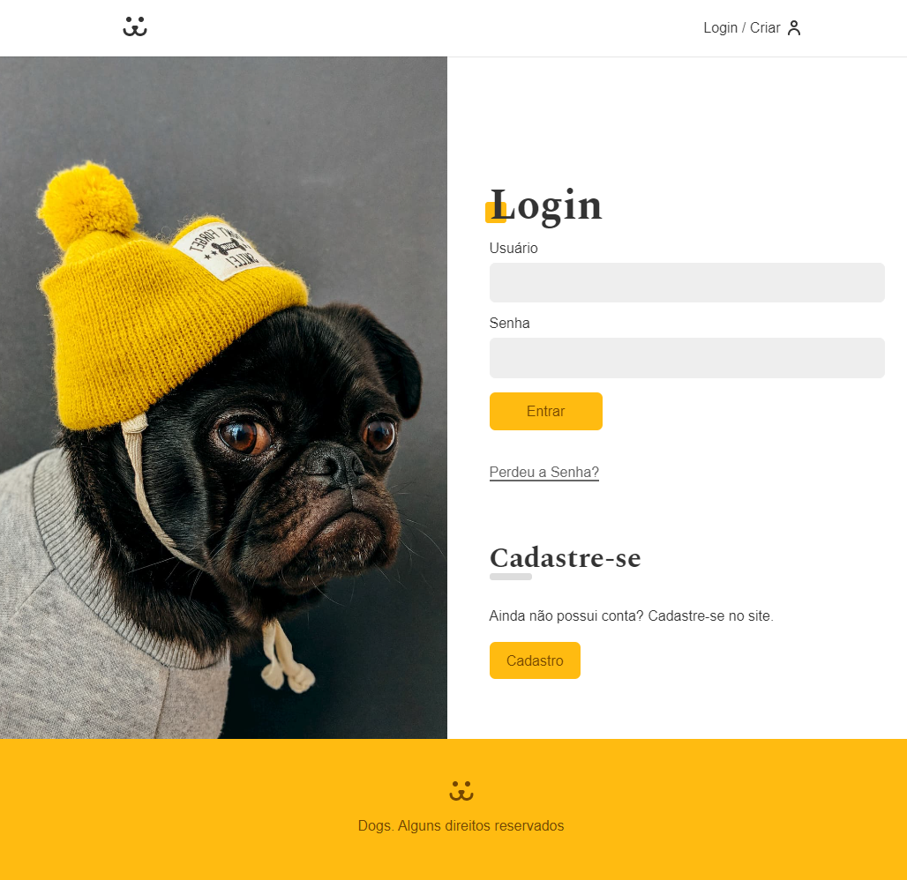

 

<h2>🔖 Description</h2>

Creation of the Dogs application, a social network for dogs created in the React course at Origamid.

 

<h2>🚀 Technologies</h2>
<ul>
    <li><a href="https://create-react-app.dev/" target="_blank">React</a></li>
    <li><a href="https://reactrouter.com/" target="_blank">React Router</a></li>
    <li><a href="https://reactrouter.com/web/guides/quick-start" target="_blank">React Router Dom</a></li>
    <li><a href="https://github.com/FormidableLabs/victory" target="_blank">Victory</a></li>
</ul>

 

<h2>ℹ️ How to use</h2>

    Clone this repository
     $ git clone https://github.com/glauberbandeira/dogs-reacts.git

    install dependencies
     $ npm install

    start the project
     $ npm start

 
Criado por <a href="https://github.com/glauberbandeira" target="_blank">Glauber Bandeira</a>
